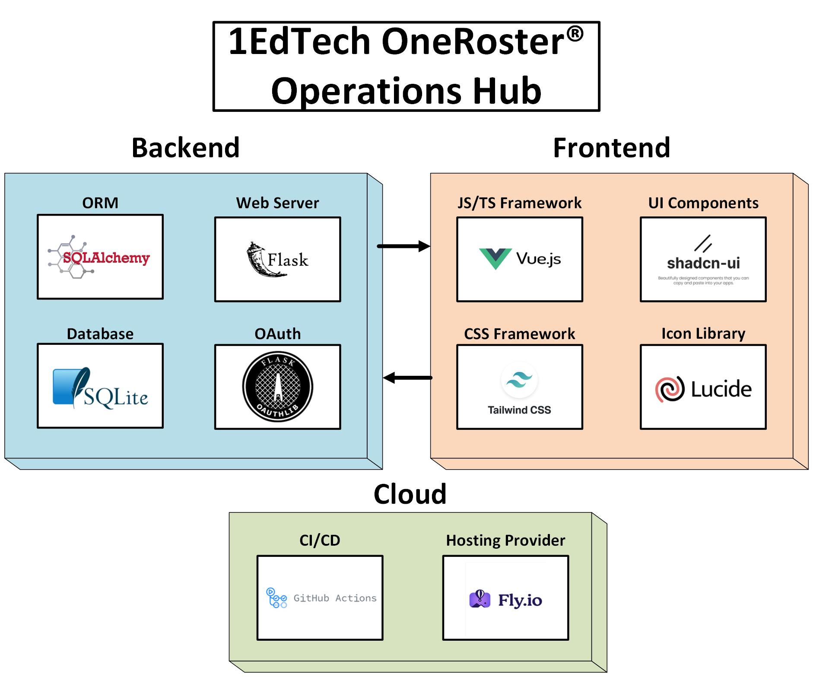

# 1EdTech OneRoster Academic Workspace



This project is a Flask + SQLite + Vue implementation of a OneRoster workspace. It exposes a OneRoster-style REST API under `/ims/oneroster/v1p1`, protects that surface with OAuth 2.0 bearer tokens, documents it with Swagger/OpenAPI, and provides a Vue SPA for browsing schools, classes, people, resources, and gradebooks.

## What This Repo Contains

- A Flask backend serving OneRoster-style endpoints for:
  - `academicSessions`
  - `classes`
  - `courses`
  - `demographics`
  - `enrollments`
  - `gradingPeriods`
  - `orgs`
  - `schools`
  - `students`
  - `teachers`
  - `terms`
  - `users`
- Resource endpoints for class and course resources
- Gradebook endpoints for categories, line items, and results
- OAuth 2.0 client-credentials token issuance
- Swagger UI and generated OpenAPI JSON
- A Vue SPA that exercises the backend routes from a single interface
- The assignment-specific provider configuration / sync / copied-data endpoints
- A SQLite schema and seed data in [app/schema.sql](OneRoster/app/schema.sql)

## Architecture

- Backend: Flask, Flask-SQLAlchemy, Flask-OAuthlib
- Database: SQLite at [app/database.db](OneRoster/app/database.db)
- Frontend: Vue 3 + Vite + Tailwind + shadcn-vue style components
- API prefix: `/ims/oneroster/v1p1`
- Swagger UI: `/ims/oneroster/v1p1`
- OpenAPI JSON: `/ims/oneroster/v1p1/openapi.json`
- OAuth token endpoint: `/ims/oneroster/v1p1/token`

## Local Run

### Backend

From the [OneRoster](OneRoster) folder:

```powershell
python -m venv .venv
.venv\Scripts\Activate.ps1
pip install -r requirements.txt
python run.py
```

The backend runs on:

```text
http://localhost:3000
```

### Frontend

From [OneRoster-Frontend](OneRoster/OneRoster-Frontend):

```powershell
npm install
npm run dev
```

The frontend runs on:

```text
http://localhost:5173
```

Vite proxies `/ims` to the Flask backend in [vite.config.ts](OneRoster/OneRoster-Frontend/vite.config.ts).

## OAuth Defaults

The app seeds a default confidential OAuth client at startup:

- `client_id`: `oneroster-client`
- `client_secret`: `oneroster-secret`

You can request a token with `client_credentials` against `/ims/oneroster/v1p1/token`, or just use the SPA Connect flow.

## Assignment Workflow Endpoints

### 1. Save provider configuration

```http
POST /ims/oneroster/v1p1/provider-configurations
Content-Type: application/json
```

Example request body:

```json
{
  "name": "Remote OneRoster Provider",
  "baseUrl": "http://localhost:3000/ims/oneroster/v1p1",
  "tokenUrl": "http://localhost:3000/ims/oneroster/v1p1/token",
  "clientId": "oneroster-client",
  "clientSecret": "oneroster-secret",
  "scopes": [
    "https://purl.imsglobal.org/spec/or/v1p1/scope/roster-core.readonly",
    "https://purl.imsglobal.org/spec/or/v1p1/scope/roster.readonly",
    "https://purl.imsglobal.org/spec/or/v1p1/scope/roster-demographics.readonly"
  ]
}
```

### 2. Pull/store provider data into the copied local store

```http
POST /ims/oneroster/v1p1/provider-configurations/{config_id}/sync
```

This endpoint:
- looks up the stored provider configuration
- requests a bearer token from that provider
- pulls the provider’s collection endpoints
- stores the copied results locally in a new set of database tables

### 3. Read the copied dataset back by configuration id

```http
GET /ims/oneroster/v1p1/provider-configurations/{config_id}/data
GET /ims/oneroster/v1p1/provider-configurations/{config_id}/data?resource=classes
```

This returns the latest successful copied dataset for that stored provider configuration without calling the remote provider again.

### Ingestion UI

The SPA includes an **Ingestion** view that drives these three assignment endpoints in order:

1. **Save Configuration** calls `POST /ims/oneroster/v1p1/provider-configurations`
2. **Sync Copied Dataset** calls `POST /ims/oneroster/v1p1/provider-configurations/{config_id}/sync`
3. **Read Copied Data** calls `GET /ims/oneroster/v1p1/provider-configurations/{config_id}/data`

The ingestion view can also read back a single copied resource with:

```http
GET /ims/oneroster/v1p1/provider-configurations/{config_id}/data?resource=classes
```

## Data Source

- The working sample dataset is stored in SQLite.
- The recreateable schema and inserts live in [app/schema.sql](OneRoster/app/schema.sql).
- The current dataset uses differentiated school, class, student, teacher, resource, and gradebook names so the UI is easier to inspect.
- Provider-sync copies are stored locally in the same SQLite database in:
  - `provider_configurations`
  - `provider_import_runs`
  - `imported_records`

## Design Notes

- The backend models were shaped to follow the OneRoster data model and vocabulary requirements already discussed during implementation.
- The API is namespaced under `/ims/oneroster/v1p1` so the SPA, Swagger UI, and backend all align on the same surface.
- Collection endpoints support pagination, sorting, filtering, and field selection through shared response handling.
- The frontend is a single-page app and uses domain-specific views instead of exposing raw endpoint lists as the primary experience.
- The assignment-specific provider sync layer was added without replacing the existing OneRoster route files.

## Verification Against The Assignment

### Completed

- The application stores OneRoster-shaped data locally in SQLite.
- The application exposes a OneRoster-style REST API for rostering entities.
- OAuth 2.0 bearer token access is implemented through a token endpoint and route protection.
- The application now exposes the exact three assignment-specific workflow endpoints:
  1. save provider configuration
  2. sync provider data by stored configuration id into a local copied store
  3. read that copied dataset by stored configuration id
- A usable README exists with run instructions and architecture context.
- A frontend is included so the stored data can be explored through the browser.

### Also Worth Knowing

- The repo goes beyond rostering-only minimum scope by also including resource and gradebook surfaces.
- The copied dataset is stored locally as imported provider records rather than overwriting the core sample OneRoster tables.
- The final repository link is not something code can invent locally; add your GitHub URL after you publish.

## Key Paths

- Backend entry: [run.py](OneRoster/run.py)
- Flask app factory: [app/__init__.py](OneRoster/app/__init__.py)
- Rostering routes: [app/routes/rostering.py](OneRoster/app/routes/rostering.py)
- Resource routes: [app/routes/resources.py](OneRoster/app/routes/resources.py)
- Gradebook routes: [app/routes/gradebooks.py](OneRoster/app/routes/gradebooks.py)
- OAuth routes: [app/routes/oauth.py](OneRoster/app/routes/oauth.py)
- Swagger/OpenAPI routes: [app/routes/docs.py](OneRoster/app/routes/docs.py)
- Assignment workflow routes: [app/routes/provider_configurations.py](OneRoster/app/routes/provider_configurations.py)
- Provider sync service: [app/services/provider_sync.py](OneRoster/app/services/provider_sync.py)
- Frontend app shell: [OneRoster-Frontend/src/App.vue](OneRoster/OneRoster-Frontend/src/App.vue)
